# 🎨 Diagrammes de Flux d'Authentification

## 1️⃣ Flux de Connexion Initiale

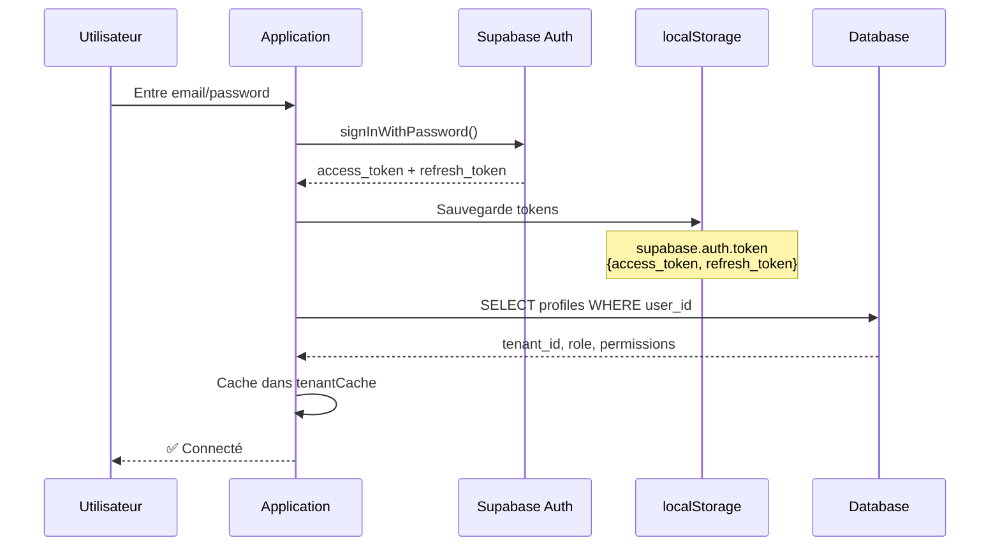

---

## 2️⃣ Flux de Reconnexion Automatique (Après Fermeture)

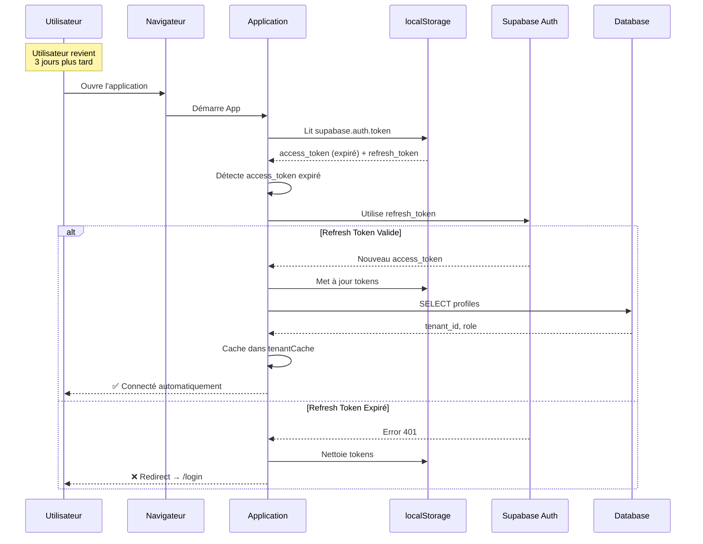

---

## 3️⃣ Refresh Token Automatique (Pendant Utilisation)

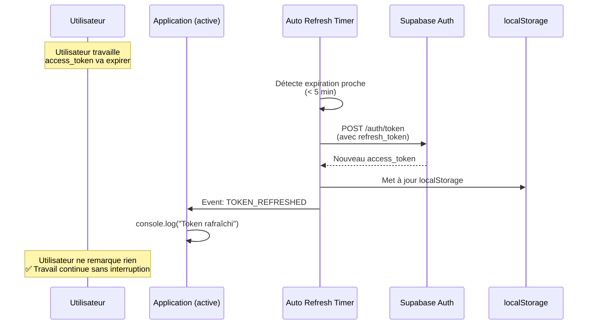

---

## 4️⃣ Architecture du Cache Tenant

```mermaid
graph TB
    subgraph "Application React"
        App[App.tsx]
        TenantProvider[TenantProvider]
        CompA[Component A]
        CompB[Component B]
        CompC[Component C]
    end
    
    subgraph "Cache Global (Singleton)"
        Cache[tenantCache<br/>{currentTenant, userMembership}]
    end
    
    subgraph "Base de Données"
        DB[(Supabase DB)]
    end
    
    App-->TenantProvider
    TenantProvider-->|Premier chargement|Cache
    Cache-->|Lit 1 fois|DB
    
    TenantProvider-->CompA
    TenantProvider-->CompB
    TenantProvider-->CompC
    
    CompA-->|Lecture instantanée|Cache
    CompB-->|Lecture instantanée|Cache
    CompC-->|Lecture instantanée|Cache
    
    style Cache fill:#90EE90
    style DB fill:#87CEEB
```

---

## 5️⃣ Comparaison des Deux Systèmes

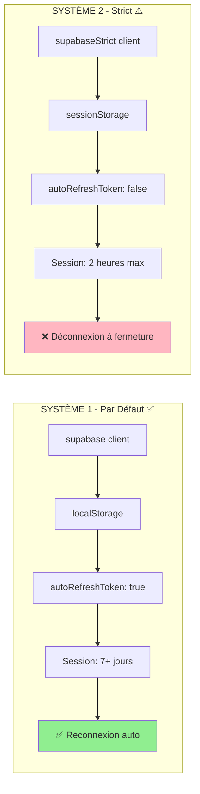

---

## 6️⃣ Cycle de Vie des Tokens

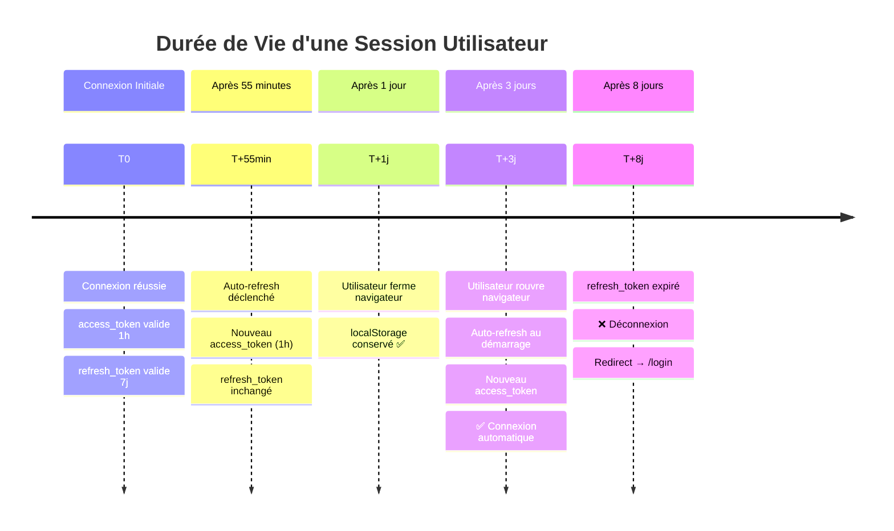

---

## 7️⃣ Décisions de Sécurité

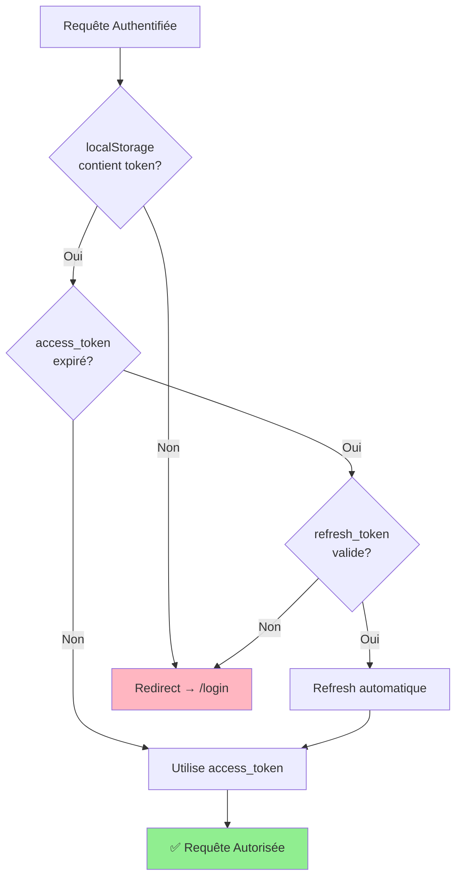

---

## 8️⃣ Performance du Cache Tenant

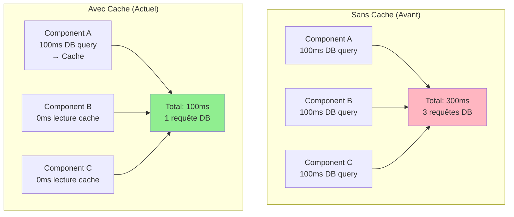

---

## 9️⃣ Isolation Multi-Tenant

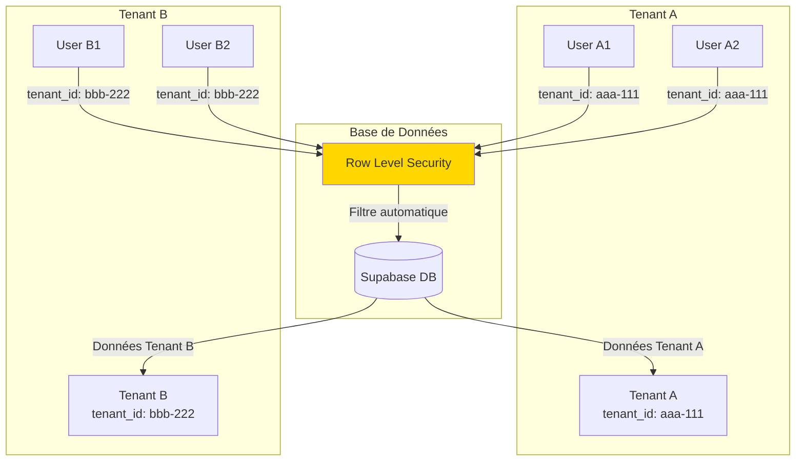

---

## 🔟 Événements d'Authentification

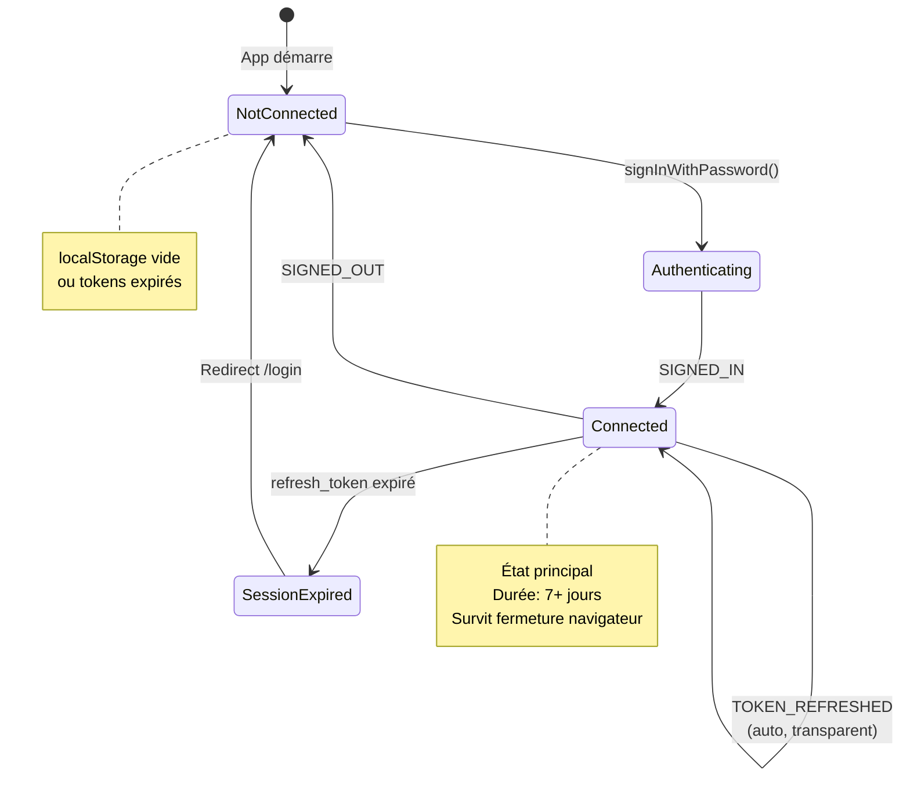

---

## 1️⃣1️⃣ Gestion des Erreurs d'Authentification

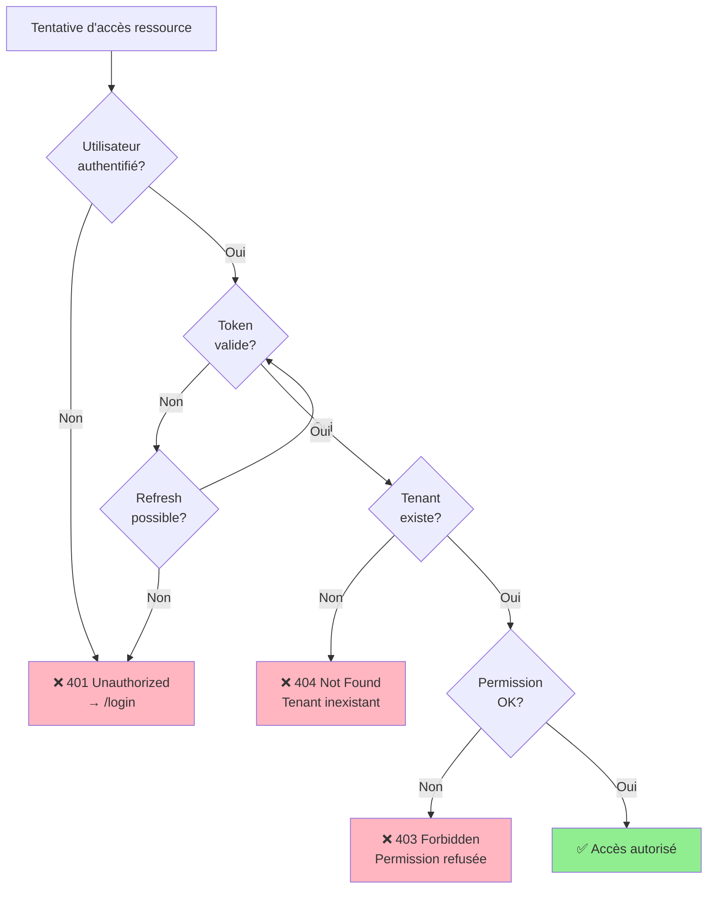

---

## 1️⃣2️⃣ Optimisation des Re-renders

```mermaid
graph TB
    subgraph "Problème Initial"
        P1[App.tsx: 37 renders]
        P2[TenantContext: Re-fetch constant]
        P3[Composants enfants: Re-renders cascade]
        P4[Performance: 787ms moyen]
        
        P1-->P2-->P3-->P4
    end
    
    subgraph "Solution Implémentée"
        S1[Cache singleton global]
        S2[React.memo sur composants]
        S3[useStableCallback pour callbacks]
        S4[Vérification cache avant fetch]
        S5[Performance: ~100ms ⚡]
        
        S1-->S2-->S3-->S4-->S5
    end
    
    style P4 fill:#FFB6C1
    style S5 fill:#90EE90
```

---

## 📊 Légende

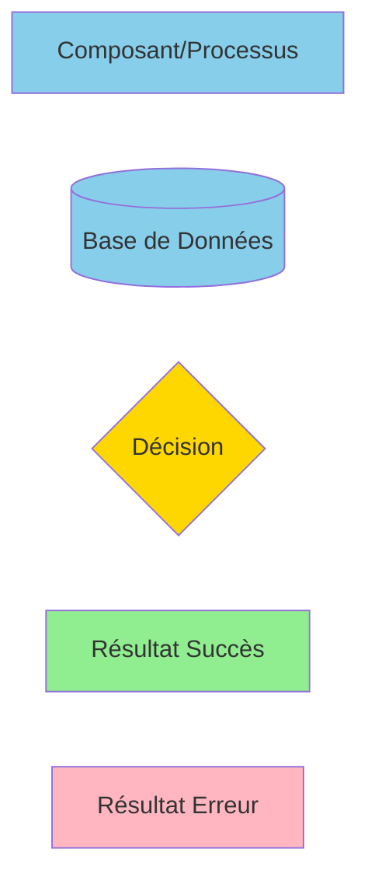

---

## 🎯 Comment Lire Ces Diagrammes

### **Diagrammes de Séquence** (1, 2, 3)
- Montrent l'ordre chronologique des événements
- Flèches : Messages entre composants
- Notes : Informations contextuelles

### **Graphes de Flux** (4, 5, 8, 9)
- Montrent l'architecture et les relations
- Flèches : Flux de données
- Couleurs : État (vert = OK, rouge = erreur)

### **Diagrammes de Décision** (7, 11)
- Montrent la logique conditionnelle
- Losanges : Points de décision
- Rectangles : Actions

### **Timeline** (6)
- Montre l'évolution temporelle
- Sections : Phases de la session
- Événements : Points clés

### **Diagramme d'États** (10)
- Montre les états possibles du système
- Transitions : Événements déclencheurs
- Notes : Détails sur les états

---

**Pour visualiser ces diagrammes** :
1. Copier le code Mermaid
2. Coller dans : https://mermaid.live/
3. Ou utiliser extension VSCode : "Markdown Preview Mermaid Support"

---

**Date** : 29 Octobre 2025  
**Format** : Mermaid.js  
**Documentation** : https://mermaid.js.org/
