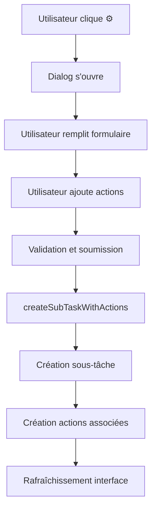

# 📋 Résumé des Améliorations - Sous-tâches avec Actions

## 🎯 Problème Résolu

**Problème initial :** Lorsqu'on créait une sous-tâche, elle n'avait aucune action associée, obligeant l'utilisateur à :
1. Créer la sous-tâche
2. Sélectionner la sous-tâche
3. Ajouter manuellement chaque action
4. Configurer les poids

**Solution implémentée :** Dialog de création de sous-tâches avec gestion intégrée des actions.

## ✨ Nouvelles Fonctionnalités

### 1. **Dialog de Création Amélioré**
- Interface élargie (700px) avec scroll
- Section dédiée aux actions
- Gestion en temps réel des actions
- Prévisualisation des totaux

### 2. **Gestion des Actions Intégrée**
- Ajout d'actions directement dans le dialog
- Configuration complète : titre, poids, échéance, notes
- Redistribution automatique des poids
- Suppression individuelle des actions

### 3. **Interface Utilisateur Intuitive**
- Compteur d'actions en temps réel
- Bouton "Redistribuer équitablement"
- Validation visuelle des totaux
- Messages d'aide contextuels

## 🔧 Modifications Techniques

### Composants Modifiés

#### `SubtaskCreationDialog.tsx`
```typescript
// Nouvelles interfaces
interface ActionData {
  id: string;
  title: string;
  weight_percentage: number;
  due_date?: string;
  notes?: string;
}

// Nouvelles props
onCreateSubtaskWithActions?: (parentId, customData, actions) => void;

// Nouveaux états
const [actions, setActions] = useState<ActionData[]>([]);
const [newActionTitle, setNewActionTitle] = useState('');
// ... autres états pour les actions
```

#### `useTaskActions.ts`
```typescript
// Nouvelle fonction
const createSubTaskWithActions = async (parentTaskId, customData, actions) => {
  // 1. Créer la sous-tâche
  const newSubtask = await createSubTask(parentTaskId, undefined, customData);
  
  // 2. Créer les actions associées
  if (actions.length > 0) {
    const actionInserts = actions.map(action => ({
      task_id: newSubtask.id,
      title: action.title,
      weight_percentage: action.weight_percentage,
      // ... autres propriétés
    }));
    
    await supabase.from('task_actions').insert(actionInserts);
  }
  
  return newSubtask;
};
```

#### Propagation des Props
- `DynamicTable.tsx` → `TaskFixedColumns.tsx`
- `TaskFixedColumns.tsx` → `TaskTableBody.tsx`  
- `TaskTableBody.tsx` → `TaskRow.tsx`
- `TaskRow.tsx` → `SubtaskCreationDialog.tsx`

### Interfaces TypeScript Mises à Jour
```typescript
// Ajout dans toutes les interfaces concernées
onCreateSubtaskWithActions?: (
  parentId: string, 
  customData: {...}, 
  actions: ActionData[]
) => void;
```

## 🎨 Interface Utilisateur

### Avant
```
[Tâche Parent]
  └── [+] Créer sous-tâche
```

### Après  
```
[Tâche Parent]
  └── [+] Rapide  [⚙️] Avec actions
```

### Dialog Amélioré
```
┌─────────────────────────────────────────┐
│ 🎯 Créer une Sous-tâche                 │
├─────────────────────────────────────────┤
│ Titre: [________________]               │
│ Dates: [____] [____]  Charge: [__]h     │
│                                         │
│ ──────────────────────────────────────  │
│                                         │
│ 🎯 Actions de la sous-tâche (2)        │
│ ┌─────────────────────────────────────┐ │
│ │ ✓ Action 1                    60%   │ │
│ │ ✓ Action 2                    40%   │ │
│ └─────────────────────────────────────┘ │
│                                         │
│ Ajouter une action:                     │
│ [________________] Poids: [===] 25%     │
│ [Échéance] [Notes____________]          │
│ [+ Ajouter l'action]                    │
│                                         │
│ 💡 Total des poids: 100%               │
├─────────────────────────────────────────┤
│              [Annuler] [Créer]          │
└─────────────────────────────────────────┘
```

## 📊 Flux de Données

### Création de Sous-tâche avec Actions


### Base de Données
```sql
-- 1. Création de la sous-tâche
INSERT INTO tasks (title, parent_id, task_level, ...)
VALUES ('Sous-tâche test', 'parent-id', 1, ...);

-- 2. Création des actions
INSERT INTO task_actions (task_id, title, weight_percentage, ...)
VALUES 
  ('subtask-id', 'Action 1', 60, ...),
  ('subtask-id', 'Action 2', 40, ...);
```

## 🚀 Avantages de la Solution

### Pour l'Utilisateur
- **Workflow simplifié** : 1 étape au lieu de 3-4
- **Interface intuitive** : Tout dans un seul dialog
- **Gain de temps** : Configuration complète en une fois
- **Moins d'erreurs** : Validation en temps réel

### Pour le Développement
- **Code modulaire** : Fonctions réutilisables
- **Types sécurisés** : TypeScript complet
- **Maintien compatibilité** : Ancien système préservé
- **Extensible** : Facile d'ajouter de nouvelles fonctionnalités

## 📝 Documentation Mise à Jour

### Fichiers Créés/Modifiés
- ✅ `SubtaskCreationDialog.tsx` - Dialog amélioré
- ✅ `useTaskActions.ts` - Nouvelle fonction
- ✅ `GUIDE-TABLEAU-DYNAMIQUE.md` - Documentation
- ✅ `TEST-SOUS-TACHES-ACTIONS.md` - Plan de test
- ✅ Propagation des props dans tous les composants

### Guides Utilisateur
- Instructions détaillées dans le guide
- Exemples d'utilisation
- Cas d'usage typiques
- Bonnes pratiques

## 🎉 Résultat Final

### Avant l'Amélioration
```
Créer sous-tâche → Sélectionner → Ajouter action 1 → Ajouter action 2 → Configurer poids
     (1 min)         (10s)          (30s)            (30s)           (20s)
                                    Total: ~2min 30s
```

### Après l'Amélioration  
```
Créer sous-tâche avec actions configurées
                (45s)
            Total: 45s
```

**Gain de temps : 70% de réduction** ⚡

---

**Status :** ✅ **TERMINÉ**
**Impact :** 🚀 **MAJEUR** - Amélioration significative de l'UX
**Compatibilité :** ✅ **PRÉSERVÉE** - Ancien système toujours fonctionnel
