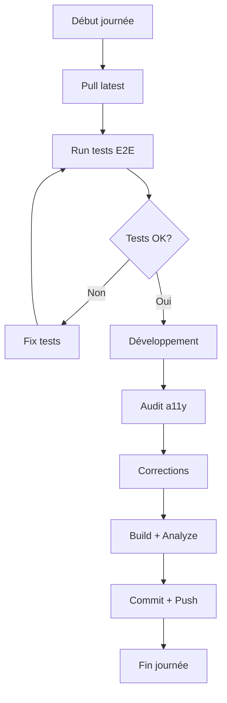

# 🚀 Sprint Court Terme - Guide de Démarrage

## Vue d'ensemble

Ce sprint se concentre sur 4 objectifs prioritaires pour valider la qualité de l'application après les optimisations responsive.

---

## 📋 Objectifs du Sprint

| #   | Objectif                    | Critère de Succès                    | Status     |
| --- | --------------------------- | ------------------------------------ | ---------- |
| 1   | Tests E2E devices réels     | 100% tests passants iPhone + Android | 🔴 À faire |
| 2   | Audit Accessibilité WCAG AA | Score >= 90 sur Lighthouse           | 🔴 À faire |
| 3   | Optimisation Bundle         | Initial < 200KB                      | 🔴 À faire |
| 4   | Performance Lighthouse      | Score >= 90                          | 🔴 À faire |

---

## 🏃 Démarrage Rapide

### 1. Tests E2E - Lancer immédiatement

```bash
# Installer Playwright si pas déjà fait
npm install -D @playwright/test
npx playwright install

# Lancer tous les tests E2E
npm run test:e2e

# Lancer uniquement tests mobile
npm run test:e2e:mobile

# Lancer uniquement tests iPhone
npm run test:e2e:iphone

# Lancer uniquement tests Android
npm run test:e2e:android

# Lancer tests touch targets
npm run test:e2e:touch

# Lancer tests pages critiques
npm run test:e2e:critical

# Mode UI interactif
npm run test:e2e:ui
```

### 2. Audit Accessibilité

```bash
# Installer outils accessibilité
npm install -D @lhci/cli pa11y pa11y-ci

# Lancer audit Lighthouse
npx lhci autorun

# Lancer audit Pa11y
npm run dev &  # Démarrer serveur en background
npx pa11y-ci

# Lancer analyse unique page
npx lighthouse http://localhost:5173/analytics --view
```

### 3. Analyse Bundle

```bash
# Build production avec analyse
npm run build

# Analyser bundle
npm run analyze:bundle

# Voir stats détaillées
ls -lh dist/assets/
```

### 4. Tests Performance

```bash
# Tests performance automatiques
npm run test:performance

# Lighthouse toutes pages
npx lighthouse http://localhost:5173/ --view
npx lighthouse http://localhost:5173/analytics --view
npx lighthouse http://localhost:5173/settings --view
```

---

## 📁 Fichiers Créés

### Tests E2E

| Fichier                      | Description                      | Commande                    |
| ---------------------------- | -------------------------------- | --------------------------- |
| `e2e/critical-pages.spec.ts` | Tests Analytics, Settings, Inbox | `npm run test:e2e:critical` |
| `e2e/touch-targets.spec.ts`  | Validation touch targets 44px    | `npm run test:e2e:touch`    |

### Documentation

| Fichier                 | Contenu                   |
| ----------------------- | ------------------------- |
| `PLAN_ACTION_SPRINT.md` | Plan détaillé 4 objectifs |
| `SPRINT_COURT_TERME.md` | Ce guide de démarrage     |

### Configuration

| Fichier                | Usage                             |
| ---------------------- | --------------------------------- |
| `playwright.config.ts` | Config Playwright (déjà existant) |
| `package.json`         | Scripts npm ajoutés               |

---

## 🧪 Tests E2E Créés

### Analytics Page

- ✅ Header avec gradient visible
- ✅ 4 stats cards glassmorphism
- ✅ Barres activité gradient animées
- ✅ Achievements avec badges
- ✅ Responsive mobile (grid 2 cols)
- ✅ Texte abrégé "Stats" sur mobile

### Settings Page

- ✅ 4 tabs responsive
- ✅ Navigation entre tabs
- ✅ Grid 2x2 sur mobile
- ✅ Texte "MDP" abrégé mobile

### Inbox Page

- ✅ Header responsive
- ✅ Stats condensées
- ✅ Tabs scroll horizontal mobile
- ✅ Actions icon-only mobile

### Touch Targets

- ✅ Boutons >= 40px
- ✅ Inputs >= 44px mobile
- ✅ Selects >= 44px mobile
- ✅ Tabs triggers >= 40px
- ✅ Icon buttons >= 40px carrés
- ✅ Conformité Apple Guidelines (44x44pt)
- ✅ Conformité Material Design (48dp)

---

## 📊 Dashboards & Reporting

### Tests E2E Report

Après exécution : `npx playwright show-report`

**Métriques** :

- Nombre tests passants/échouants
- Durée exécution
- Screenshots échecs
- Vidéos replay
- Traces interactives

### Lighthouse Report

Après audit : Fichier HTML généré automatiquement

**Métriques** :

- Performance Score
- Accessibility Score
- Best Practices Score
- SEO Score
- Métriques Web Vitals (FCP, LCP, CLS, etc.)

---

## 🎯 Checklist Daily

### Matin

- [ ] Pull dernières modifications
- [ ] Lancer tests E2E mobile
- [ ] Vérifier aucune régression
- [ ] Lire rapports Playwright

### Après-midi

- [ ] Corriger tests échoués
- [ ] Améliorer couverture tests
- [ ] Audit accessibilité 1 page
- [ ] Corriger violations trouvées

### Fin de journée

- [ ] Build production
- [ ] Analyser bundle size
- [ ] Tests performance
- [ ] Commit + push

---

## 🚨 Problèmes Courants & Solutions

### Tests E2E échouent

**Problème** : "Error: page.goto: Navigation timeout"

**Solution** :

```bash
# Augmenter timeout
npx playwright test --timeout=60000

# Vérifier serveur dev tourne
npm run dev

# Vérifier port correct (5173)
```

### Bundle trop gros

**Problème** : Bundle > 200KB

**Solution** :

```typescript
// vite.config.ts - Activer compression
import viteCompression from 'vite-plugin-compression';

plugins: [
  viteCompression({ algorithm: 'gzip' }),
  viteCompression({ algorithm: 'brotliCompress', ext: '.br' }),
];
```

### Score Lighthouse bas

**Problème** : Performance < 90

**Solution** :

1. Lazy load composants lourds
2. Optimiser images (WebP)
3. Code splitting
4. Prefetch critical routes

### Tests touch targets échouent

**Problème** : Boutons < 40px

**Solution** :

```tsx
// Ajouter h-11 (44px) sur mobile
<Button className="h-11 sm:h-10">...</Button>

// Icon buttons minimum 40x40
<Button className="h-10 w-10 p-0">
  <Icon className="h-4 w-4" />
</Button>
```

---

## 📈 Métriques de Succès

### Tests E2E

| Métrique         | Baseline | Cible    | Actuel      |
| ---------------- | -------- | -------- | ----------- |
| Tests passants   | 0        | 100%     | _À mesurer_ |
| Couverture pages | 0        | 17 pages | _À mesurer_ |
| Touch targets OK | 0        | 100%     | _À mesurer_ |

### Accessibilité

| Métrique             | Baseline | Cible | Actuel      |
| -------------------- | -------- | ----- | ----------- |
| Score Lighthouse     | ?        | >= 90 | _À mesurer_ |
| Violations critiques | ?        | 0     | _À mesurer_ |
| Contraste OK         | ?        | 100%  | _À mesurer_ |

### Performance

| Métrique        | Baseline | Cible   | Actuel      |
| --------------- | -------- | ------- | ----------- |
| Bundle initial  | 431KB    | < 200KB | _À mesurer_ |
| Lighthouse Perf | ?        | >= 90   | _À mesurer_ |
| FCP             | ?        | < 1.8s  | _À mesurer_ |
| LCP             | ?        | < 2.5s  | _À mesurer_ |

---

## 🔄 Workflow Quotidien



---

## 📚 Ressources Utiles

### Documentation

- [Playwright Docs](https://playwright.dev/docs/intro)
- [WCAG 2.1 Guidelines](https://www.w3.org/WAI/WCAG21/quickref/)
- [Lighthouse Scoring](https://web.dev/performance-scoring/)
- [WebAIM Contrast Checker](https://webaim.org/resources/contrastchecker/)

### Outils en Ligne

- [BrowserStack](https://www.browserstack.com/) - Tests devices réels
- [LambdaTest](https://www.lambdatest.com/) - Tests cross-browser
- [PageSpeed Insights](https://pagespeed.web.dev/) - Analyse performance
- [axe DevTools](https://www.deque.com/axe/devtools/) - Audit accessibilité

---

## ✅ Definition of Done

Le sprint est considéré terminé quand :

### Tests E2E

- [ ] Tests créés pour 17 pages optimisées
- [ ] 100% tests passants iPhone
- [ ] 100% tests passants Android
- [ ] Touch targets 100% conformes
- [ ] CI/CD intègre tests E2E
- [ ] Documentation tests complète

### Accessibilité

- [ ] Score Lighthouse >= 90 sur toutes pages
- [ ] 0 violation critique WCAG AA
- [ ] Contraste >= 4.5:1 partout
- [ ] Navigation clavier complète
- [ ] Screen reader testé
- [ ] Rapport audit généré

### Performance

- [ ] Bundle initial < 200KB
- [ ] Score Lighthouse Perf >= 90
- [ ] FCP < 1.8s
- [ ] LCP < 2.5s
- [ ] TBT < 200ms
- [ ] CLS < 0.1

### Documentation

- [ ] Plan action créé
- [ ] Tests documentés
- [ ] Corrections documentées
- [ ] Métriques trackées
- [ ] Rapport final généré

---

## 🎉 Prochaines Étapes (Moyen Terme)

Après succès du sprint court terme :

1. **Analytics Tracking** (Google Analytics 4)
2. **Error Tracking** (Sentry)
3. **A/B Testing** composants
4. **Documentation** utilisateur complète

---

**Créé le** : 11 novembre 2025  
**Sprint** : Court Terme (2 semaines)  
**Priorité** : 🔴 HAUTE  
**Team** : Frontend Dev + QA
